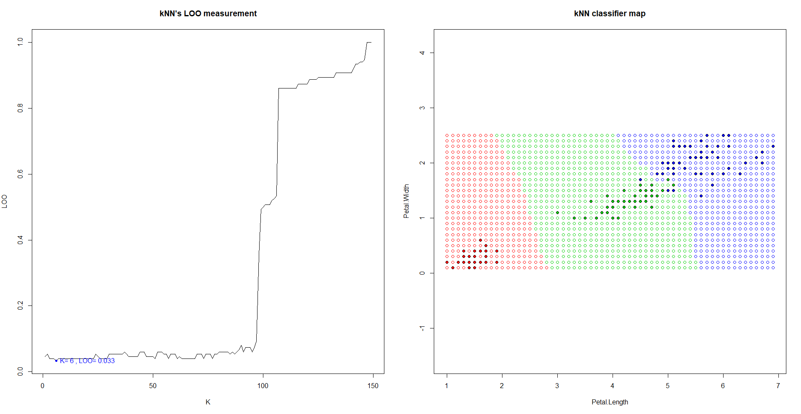
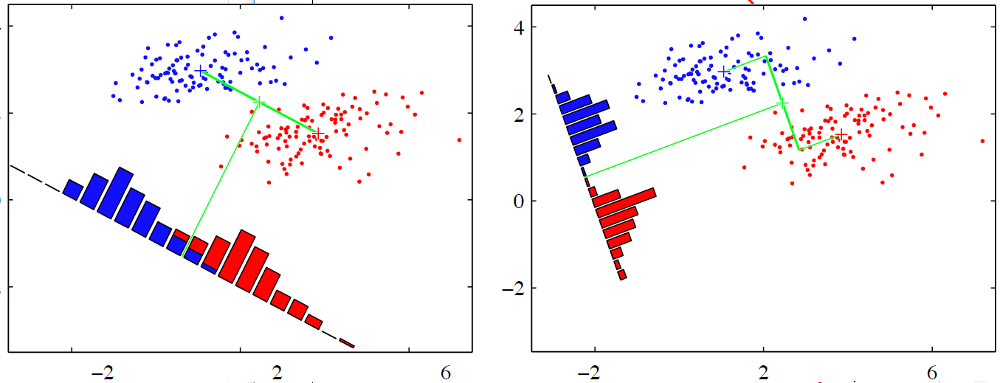
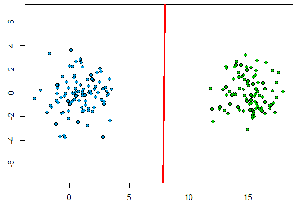
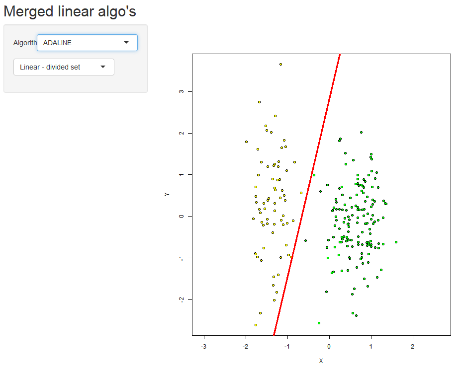
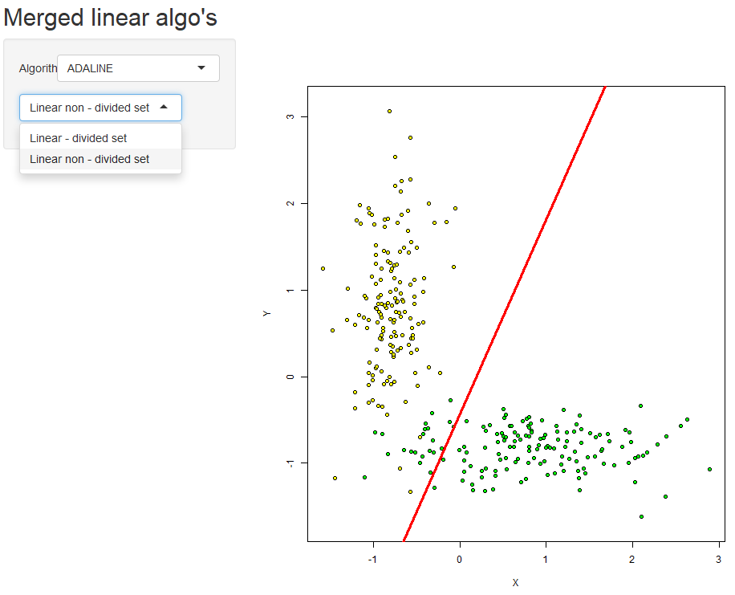

# Метрические алгоритмы классификации
## Алгоритм k ближайших соседей (kNN)
- **KNN** - метрический алгоритм классификации, основанный на оценивании сходства объектов. Классифицируемый объект относится к тому классу, которому принадлежат ближайшие к нему объекты обучающей выборки. 

Данный алгоритм, как и пара следующих рассмотренных методов, основываются на _**гипотезе компактности:**_ если мера сходства объектов введена достаточно удачно, то схожие объекты гораздо чаще лежат в одном классе, чем в разных. В этом случае граница между классами имеет достаточно простую форму, а классы образуют компактно локализованные области в пространстве объектов. 

Пусть задана обучающая выборка пар «объект-ответ».

Пусть на множестве объектов задана функция расстояния . Эта функция должна быть достаточно точной _"мерой"_ сходства объектов.
Для точки **_u_** выборки отсортируем остальные её объекты по возрастанию значения расстояния до **_u_**.
Для успешного обучения выборка должна быть пересортирована для каждого новой точки **_u_**. 

В общем виде алгоритм **_kNN_** выглядит так :
,
где  — мера _«важности»_ (вес) объекта 

Алгоритм зависит от параметра _k_, оптимальное значение которого определяется по критерию скользящего контроля,в нашем случае используется метод исключения объектов по одному (leave-one-out cross-validation).

**_Проще говоря_**, алгоритм от произвольной точки _U_ сортирует остальную выборку по расстоянию до _U_, и _относит её к классу_, который имеет максимальное значение объектов среди первых **_K_** соседей **U**.

### Реализация

Src: [ссылка](kNN.R)  
Основной интерес реализации заключён в двух функциях:

### KNN
```R
#Функция получает в качестве параметров отсортированную выборку и количество ближайших соседей
DT.kNN.kNN = function(sortedDist, k) { 
    kDist = sortedDist[1:k] #Берём только первых K отсортированных объекта выборки
    kClasses = names(kDist) #получаем названия классов первых K соседей с помощью функции names()
    class = names(which.max(table(kClasses))) 
    #функция возвращает название класса, объектов которого больше всего среди K соседей.
    return(class)
}
```
### LOO
Данная функция была обобщена для трёх классификаторов и была вынесена в отдельный исходник,функция принимает points - массив точек обучающей выборки, в нашем случае - столбцы матрицы iris[,3:4];  
classes - столбец с названиями классов элементов выборки, iris[,5]  
Для определения классификатора и выбора соответствующего варианта подсчёта LOO передаётся функция классификатора; hlim - параметр для Парзеновского окна, для kNN не имеет значения
```R
DT.Util.LOO = function(points, classes, classFunc, hLims = 0) {
  n = dim(points)[1]# берём количество элементов из первого столбца
  if(identical(classFunc, DT.kNN.kNN) || identical(classFunc, DT.WkNN.WkNN)) { #сравнение методов,см выше
  loo = double(n-1) #n-1 поскольку мы всегда удаляем один элемент для LOO
  
  for (i in 1:n) { #идём по выборке
  #находим эвклидовы расстояния от нашей точки до оставшейся выборки без нашей точки - points[-i]
    distances = DT.Util.getDist(points[-i,], points[i,], DT.Util.euclidDist) 
    names(distances) = classes[-i] #присваиваем имена классов точек в массиве расстояния
    sortDist = sort(distances) #сортируем по расстоянию
    #вложенный цикл нужен для подсчёта 
    for (l in 1:n - 1) { 
      bestClass = classFunc(sortDist, l) #вызов kNN для l соседей
      loo[l] = loo[l] + ifelse(bestClass == classes[i], 0, 1) 
      } #если классификатор ошибся, увеличиваем LOO при l соседях
    }
  } # вот так вот просто можно поделить весь массив на число элементов выборки
    loo = loo / n
  return(loo)
}
```




Используется датасет iris по лепесткам (ширина и длина -наиболее подходящие для классификации параметры )

Подбор оптимального количества соседней (_k_) отображается на графике **LOO** слева. Для реализованного классификатора _k_ = 6, при **_LOO_** равное 0.033, что соответствует ~5 неправильно классифицируемым элементам выборки.

Параметр _k_, как видно на графике LOO, в первой сотне имеет относительно низкий показатель ошибок классификации, при больших показателях _k_ погрешность стремительно растёт. Происходит это из - за фундаментального недостатка самого алгоритма **KNN**, который **не**
учитывает расстояние точки до соседей, учитывая <u>только</u> их наличие (Исправлено в ***kWNN***). Т.е, у **_n_**-ого соседа будет **"вес"** как у, например, ближайшего.  

----

# Байесовские алгоритмы классификации
Байесовские алгоритмы классификации основаны на принципе максимума апостериорной вероятности : для классифицируемого объекта вычисляются плотности распределения   — **_функции правдоподобия_** классов, по ним вычисляются ***апостериорные вероятности*** - , где - ***априорные вероятности*** классов. Объект относится к классу с максимальной апостериорной вероятностью.

*Задача классификации* - получить алгоритм , способный классифицировать произвольный объект .  

1)  ***Построение классификатора при известных плотностях***  
 - штраф за неправильное отнесение объекта класса ***𝑦***.  
Если известны   и , то минимум среднего риска ,   достигается алгоритмом 

2) ***Восстановление плотностей по выборке***  
По подвыборке  класса *y* строим эмпирические оценки   (доля объектов в выборке) и .  
Три метода:  
**1)Параметрический** если плотности нормальные (гауссовские) - НДА и ЛДФ;  
**2)Непараметрический** - оценка Парзена - Розенблатта, метод парзеновского окна;   
**3)Разделение смеси** производится _ЕМ-алгоритмом_. Плотности компонент смеси (гауссовские плотности) - радиальные функции,метод радиальных базисных функций.


***Линейный дискриминант Фишера***

***Ковариационные матрицы*** классов равны, классы **s, t** равновероятны и равнозначны , признаки некоррелированы и имеют одинаковые ***дисперсии*** .  

Это означает, что классы имеют одинаковую сферическую форму, разделяющая плоскость проходит посередине между классами, ортогонально линии, соединяющей центры классов. Нормаль оптимальна - прямая, в одномерной проекции на которую классы разделяются наилучшим образом,с наименьшим байесовским риском **R(a)**.



Применяя  , квадратичные члены сокращаются и уравнение поверхности
вырождается в линейную форму: , где  - точка посередине между центрами классов.


### Реализация

Src: [ссылка](LDF.R) 

Код существенно не отличается от предыдущего алгоритма.

**Результаты**



Алгоритм неплохо работает, когда формы классов действительно близки к нормальным и не слишком сильно различаются.  

В этом случае линейное решающее правило близко к оптимальному байесовскому, но устойчивее квадратичного, и часто обладает лучшей обобщающей способностью.

-------

# Линейные алгоритмы классификации 


Рассматривается задача классификации с двумя классами **Y={-1,+1}**. Модель алгоритма - параметрическое отображение ***a(x,w) = sign f(x, w)***  , где ***w - вектор параметров***, а ***f(x, w)*** - *дискриминантная функция*. 

Если её значение **> 0**, объект относится к классу **+1**, иначе **-1**. Уравнение ***f(x, w) = 0*** описывает разделяющую поверхность. 

 - *отступ* объекта  относительно классификатора. Если отступ отрицательный - алгоритм ошибся в классификации на объекте. Больше отступ - правильнее и надёжнее классификация объекта .  


 - *функция потерь*, а функция отступа - монотонно невозрастающая, мажорирующая пороговую ф-ю потерь : . Тогда минимизация суммарных потерь - это метод минимизации числа ошибок на выборке: 

 


Если дискриминантная функция - , получим ***линейный классификатор***:  

***Стохастический градиент***  

Необходимо найти вектор параметров , где достигается минимум эмпирического риска.

Веса _w_  подбираются в цикле, на каждом шаге веса сдвигаются в направлении антиградиента  
  

Алгоритм получает обучающую выборку, темп обучения  и параметр сглаживания . Перед применением метода выборка подготавливается и нормируется:  

__Признаковое нормирование__


, где _m_ – среднее арифмитическое значение признака _j_,

– среднеквадратическое отклонение.

__Подготовка__

Разделяющая поверхность
.

У нас объект имеет всего два признака.
.
У разделяющей прямой нет св. коэфф-та, добавим фиктивный параметр *=-1* :
.

***Подробный алгоритм SG***

1. Инициализация весов
.

2. Вычисление начального приближения


3. ***Пока  _Q_ не стабилизировано*** и в выборке присутствуют объекты с отрицательным **М**, ***повторять:***  
Условия выше иногда может быть не достаточно, алгоритм может остановиться, не получив необходимого результата, если два раза подряд выберет похожие элементы. Увеличим количество повторов выбора до десяти во избежание этого (меньшие значения были также проверены, и их было недостаточно).
 
4. Выбрать случайный элемент  
5. Ошибка: 
6. Шаг градиентного спуска: 
7. Оценка: 

Линейные алгоритмы отличаются функцией потерь

, где

– отступ.

***ADALINE***

Линейный алгоритм классификации, основан на методе стохастического градиента
. - квадратичная функция потерь.
Производная берётся по _w_ и равна .  
Получили правило обновления весов на каждой итерации метода *SG* - **дельта - правило:**
.

 [Программная реализация](https://zoncker.shinyapps.io/LinearMerged/) была выполнена с использованием библиотеки Shiny(Бесплатный хост - это нечто!) для построения графического интерфейса (пусть и ужасного), стохастический градиент был унифицирован для трёх классификаторов, также на выбор пользователю предлагается два набора параметров задания выборки, когда она линейно - разделима и когда - нет. [Исходник](../LinearMerged/app.R)
 
 Результаты работы:
 
  
 
### Реализация

Src: [ссылка](ADALINE.R) )  
